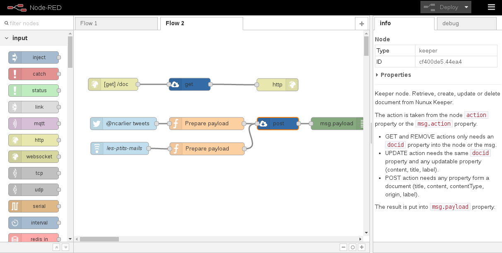

node-red-contrib-keeper
=======================

<a href="http://nodered.org" target="_new">Node-RED</a> node to save and
retrieve document from Nunux Keeper v2.

Please note that this node is not compatible with Nunux Keeper v1.

---

### :warning::warning::warning:This project is discontinued:warning::warning::warning:

**Please consider to use [node-red-contrib-openid](https://github.com/ncarlier/node-red-contrib-openid) as replacement**

---

Install
-------

Run the following command in the root directory of your Node-RED install

    npm install node-red-node-keeper

Usage
-----

### Request node

Create, update, delete or retrieve a document from Nunux Keeper v2.

The document on Keeper is taken from the node `docid` property or the
`msg.docid` property.

The document content is sent as `msg.payload` property. If the request fails
`msg.error` will contain an error object.

To create a document The message payload should be as follow:

- `title`: Document title
- `label`: Label to classify the document (The label ID)
- `content`: Document content
- `contentType`: Document type
- `origin`: Document origin URL

All attributes are optional. If only `origin` attribute is provided, then the
document will be extracted from the endpoint.
